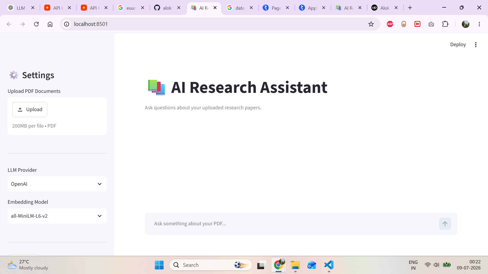
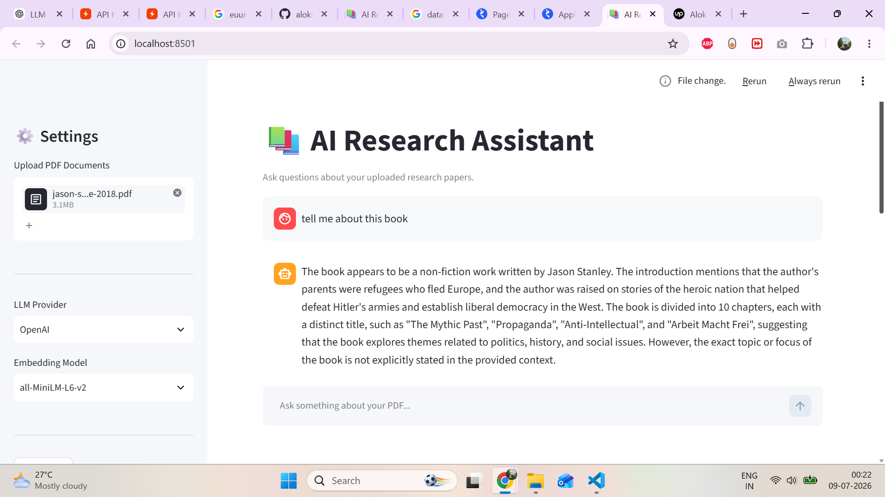

# 📚 AI Research Assistant

A Retrieval-Augmented Generation (RAG) application built with **LangChain**, **ChromaDB**, **Hugging Face Embeddings**, **Groq LLM**, and **Streamlit**. Upload PDF documents, perform semantic search, and receive AI-generated answers grounded in your documents.

---

## 🚀 Features

* 📄 Upload one or multiple PDF documents
* ✂️ Automatic text chunking
* 🧠 Hugging Face sentence embeddings
* 📚 ChromaDB vector database
* 🔍 Semantic similarity search
* 🤖 Groq LLM for answer generation
* 💬 Interactive Streamlit chat interface
* 📊 Document metadata display

---

## 🏗️ RAG Pipeline

```text
PDF Upload
    ↓
Text Extraction
    ↓
Chunking
    ↓
Embeddings
    ↓
ChromaDB
    ↓
Retriever
    ↓
Groq LLM
    ↓
Final Answer
```

---

## 🛠️ Tech Stack

* Python
* Streamlit
* LangChain
* ChromaDB
* Hugging Face (`all-MiniLM-L6-v2`)
* Groq API
* PyMuPDF

---

## 📸 Application

### Home Page



### Chat Interface



---

## ⚙️ Installation

```bash
git clone https://github.com/aloksharma123/AI_research_assistant.git
cd AI_research_assistant

python -m venv .venv
.venv\Scripts\activate

pip install -r requirements.txt
```

Create a `.env` file:

```env
GROQ_API_KEY=your_api_key_here
```

Run the application:

```bash
streamlit run app.py
```

---

## 📂 Project Structure

```text
src/
├── chains/
├── embeddings/
├── llm/
├── loaders/
├── preprocessing/
├── retriever/
├── services/
├── utils/
└── vectordb/
```

---

## 📈 Future Improvements

* DOCX & TXT support
* OCR for scanned PDFs
* Conversation memory
* Source citations
* Hybrid search
* Docker deployment

---

## 👨‍💻 Author

**Alok Sharma**

GitHub: https://github.com/aloksharma123

If you found this project useful, consider giving it a ⭐.
